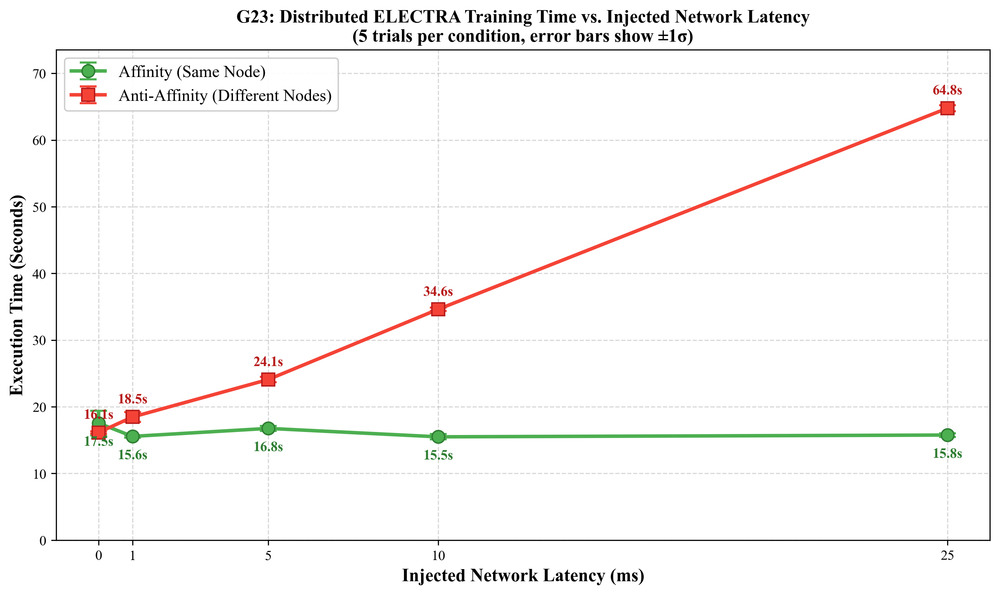
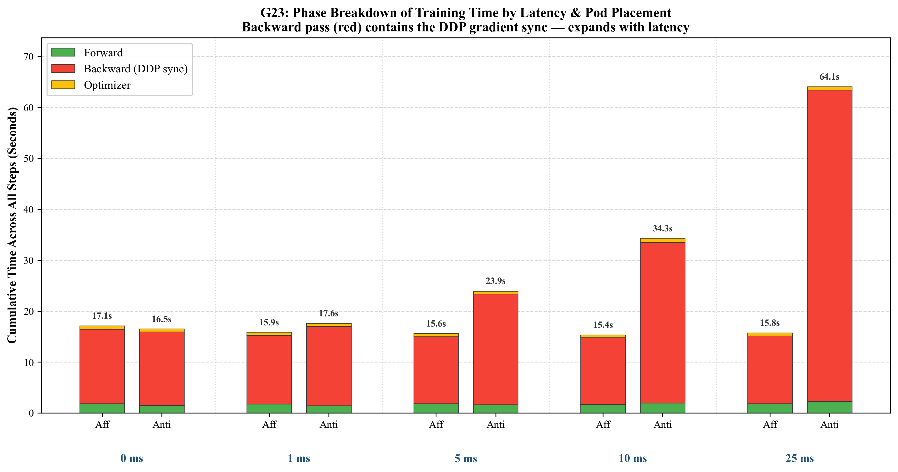

# Scheduling-Induced Network Bottlenecks in Distributed LLM Training on Kubernetes

**Course:** Graduate Systems (CSE638) — IIIT Delhi
**Team Members:** Akash Chakraborty

## 1. Overview

Distributed data-parallel (DDP) training synchronises gradients over the network on every step, but the default Kubernetes scheduler knows nothing about that traffic and may place tightly-coupled pods on different nodes. This project measures what that costs.

We containerise an **ELECTRA-style dual-network workload** (a generator and a discriminator, each wrapped in PyTorch DDP, `gloo` backend, CPU) and run it on a local multi-node [kind](https://kind.sigs.k8s.io/) cluster under two scheduling policies:

| Policy | Kubernetes rule | Effect |
|---|---|---|
| **Affinity** | `podAffinity` on `kubernetes.io/hostname` | all DDP pods co-located on one node |
| **Anti-affinity** | `podAntiAffinity` on `kubernetes.io/hostname` | every DDP pod on a different node |

Because kind's "nodes" are Docker containers on one machine, cross-node traffic is unrealistically fast. We therefore inject controlled latency with **`tc netem`** on the worker nodes and sweep it (0, 1, 5, 10, 25 ms) for **2-pod and 4-pod** jobs, 5 trials per condition — **100 experiments** in total.

> **Scope note.** This is a *measurement study*. The workload reproduces ELECTRA's communication pattern (two models synchronised every step); it does **not** perform real ELECTRA pre-training (dummy data, no masked-LM objective). We did not build a scheduler — we quantify why one is needed.

## 2. Key Results

Mean total time for 50 training steps, mean ± σ over 5 trials (σ = population std). Slowdown = anti-affinity vs. affinity.

| Injected latency | 2 pods: Affinity | 2 pods: Anti-aff. | Slowdown | 4 pods: Affinity | 4 pods: Anti-aff. | Slowdown |
|---:|---:|---:|---:|---:|---:|---:|
| 0 ms  | 17.4 ± 1.4 s | 16.0 ± 0.4 s | −7.8 %  | 36.8 ± 1.3 s | 32.3 ± 0.4 s | −12.2 % |
| 1 ms  | 15.9 ± 0.2 s | 16.8 ± 0.2 s | +6.0 %  | 36.2 ± 0.6 s | 35.2 ± 2.0 s | −2.9 % |
| 5 ms  | 16.0 ± 0.8 s | 25.0 ± 0.5 s | +56.1 % | 35.9 ± 0.3 s | 44.7 ± 0.3 s | +24.4 % |
| 10 ms | 17.1 ± 0.6 s | 35.8 ± 1.1 s | +109.0 % | 36.4 ± 0.5 s | 62.0 ± 0.3 s | +70.3 % |
| 25 ms | 16.5 ± 0.2 s | 65.2 ± 0.8 s | +296.2 % | 36.0 ± 0.5 s | 108.4 ± 0.5 s | +201.3 % |




**What the data shows**

1. **Co-located pods are insensitive to injected latency.** Affinity stays at ~16–17 s (2 pods) and ~36 s (4 pods) across the whole sweep — their traffic never leaves the node's internal bridge, so it never crosses the delayed `eth0`.
2. **Spread pods slow down roughly linearly with latency.** From the 0 → 25 ms endpoints: ≈ 2.0 s per ms (2 pods) and ≈ 3.0 s per ms (4 pods).
3. **The added time is in the backward pass**, where DDP performs gradient all-reduce. Backward's share of step time rises from 87 % → 95.6 % (2 pods) and 89 % → 95.9 % (4 pods, anti-affinity); forward and optimizer time stay flat.
4. **Traffic volume does not change — throughput does.** Rank 0 transmits the same ≈ 2,406 MB (2 pods) / ≈ 3,610 MB (4 pods) per run at every latency. For 2-pod anti-affinity that is ≈ 150 MB/s at 0 ms versus ≈ 37 MB/s at 25 ms (derived: TX bytes ÷ wall time).
5. **The machine goes idle waiting on the network.** Average CPU utilisation during anti-affinity runs falls from ≈ 91 % → 26 % (2 pods) and ≈ 95 % → 32 % (4 pods). *(This is VM-wide CPU — see §4.)*
6. **More workers make it worse.** At 25 ms, anti-affinity goes from 65 s (2 pods) to 108 s (4 pods). Even co-located, 4 pods are ~2.2× slower than 2 pods (36 s vs 16.5 s); we did not isolate the cause (CPU contention on the shared host and larger collectives are candidates).
7. **Co-location is not free of trade-offs at ~0 ms.** With no injected latency, spread placement was *not* slower — it was 8 % (2 pods) and 12 % (4 pods) faster. The crossover where co-location starts to win lies between 0–1 ms (2 pods) and 1–5 ms (4 pods). We did not investigate why spread placement is faster at 0 ms.

## 3. Workload and Experimental Design

**Workload (`G23_electra_train.py`).** `DummyGenerator` (1024→4096→1024) and `DummyDiscriminator` (1024→4096→1) are each wrapped in `DistributedDataParallel`. Together they have **12,596,225 parameters ≈ 50.4 MB of fp32 gradients synchronised every step**. Each step: forward through generator → discriminator, MSE loss, backward (triggers DDP all-reduce for *both* models), SGD step. Batch = 64 × 1024 random floats; 50 steps. Rank 0 records timings.

**Pods.** A Kubernetes `Service` (`electra-master-svc`, port 29500) is the rendezvous address. `RANK`, `WORLD_SIZE`, `MASTER_ADDR`, `MASTER_PORT` are passed as environment variables. Pods use `restartPolicy: Never` so finished pods stay `Succeeded` and are not restarted.

**Latency injection.** `G23_netem_apply.sh <ms>` runs `tc qdisc add dev eth0 root netem delay <ms>ms` inside every `llm-cluster-worker*` container. The delay is applied to **egress on each worker**, so a request/response pair crosses two delayed egresses (added RTT ≈ 2 × value). Only fixed delay is modelled (no jitter, loss or bandwidth limit).

**Sweep.** For each latency: 5 trials × affinity, then 5 trials × anti-affinity. Each trial: apply manifests → wait for master `Succeeded` → extract CSV from pod logs → delete pods.

**Data extraction.** `kubectl cp` cannot read a completed pod, so the script prints its CSV between `===CSV_START===` / `===CSV_END===` markers and the sweep scripts extract it from `kubectl logs`.

**Per-step CSV columns (`results*/G23_results_<policy>_run<N>.csv`, 50 rows each):**

| Column | Meaning |
|---|---|
| `step`, `loss` | step index, MSE loss |
| `step_time_sec` | wall time of the step |
| `forward_time_sec` | both forwards + loss |
| `backward_time_sec` | `loss.backward()` incl. DDP all-reduce |
| `optimizer_time_sec` | `optimizer.step()` |
| `cumulative_sec` | time since the first step began (last row = run total) |
| `cpu_pct` | CPU busy % from `/proc/stat` during the step |
| `net_rx_bytes`, `net_tx_bytes` | rank-0 `eth0` bytes during the step (`/proc/net/dev`) |

## 4. Interpretation Caveats

- **Single host.** All kind nodes share one machine's CPU/memory; absolute times are not representative of a real cluster. The *trends* are the finding.
- **25 ms is high for a data centre.** Typical intra-DC latency is sub-millisecond to a few ms; the 1–5 ms rows are the most realistic, 10–25 ms model cross-zone or degraded fabrics.
- **`cpu_pct` is VM-wide, not per-pod.** `/proc/stat` is not namespaced inside containers, so it reflects the whole Docker VM (all kind nodes). The trend is meaningful because only the training pods are busy, but do not read it as one pod's utilisation.
- **"Backward" ≠ pure network time.** DDP overlaps all-reduce with backward compute, so backward time = compute + non-overlapped communication. It is an upper bound on communication attribution.
- **Timed region = the 50 steps only** (excludes scheduling, image start, rendezvous, DDP construction). Step 0 (warm-up) is included in totals.
- **Statistics.** 5 trials/condition; σ uses `numpy.std` (ddof = 0). The 0 ms affinity 2-pod condition has the widest spread (±1.4 s).
- **CPU/`gloo` only.** No GPU/NCCL; results may differ with NVLink/RDMA-class fabrics.

## 5. Repository Structure

| File | Purpose |
|---|---|
| `G23_Dockerfile` | `python:3.10-slim` + CPU PyTorch + numpy; copies the training script |
| `G23_electra_train.py` | DDP workload + per-step instrumentation |
| `kind-config.yaml` | 1 control-plane + 4 workers (needed for 4-pod anti-affinity) |
| `G23_k8s_affinity.yaml` / `G23_k8s_antiaffinity.yaml` | 2-pod manifests (master + 1 worker) |
| `G23_k8s_affinity_w4.yaml` / `G23_k8s_antiaffinity_w4.yaml` | 4-pod manifests (master + 3 workers, shared label `group: electra-ddp`) |
| `G23_netem_apply.sh` / `_clear.sh` / `_status.sh` | apply / remove / inspect `tc netem` on all workers |
| `G23_sweep_run.sh` / `G23_sweep_run_w4.sh` | full latency sweep for 2 pods / 4 pods |
| `G23_sweep_summary.py` | aggregates all `results*/` folders → `G23_sweep_summary.csv` |
| `G23_sweep_plot.py` / `G23_phase_plot.py` | latency line chart / stacked phase chart |
| `G23_plot.py` | per-folder bar + per-step charts (`make plot-folder`) |
| `G23_Makefile` | build, run, sweep, plot, netem and cleanup targets |
| `results_<N>ms/`, `results_w4_<N>ms/` | raw per-trial CSVs (2-pod / 4-pod) — shipped reference data |
| `G23_sweep_summary.csv`, `G23_sweep_plot.png`, `G23_phase_plot.png` | generated summary and figures |

## 6. Prerequisites

Tested on Apple-silicon macOS with Docker Desktop 29.2, kubectl v1.34.1 and kind node image `kindest/node:v1.35.0`. Linux should work the same way (the netem scripts only need Docker and `tc` inside the node image) but is untested.

- Docker (Desktop) — give it generous CPU/RAM; the cluster has 5 node containers plus up to 4 training pods
- [kind](https://kind.sigs.k8s.io/) (`brew install kind`), `kubectl`, `make`
- Python 3 with `numpy` and `matplotlib` for the analysis scripts (`pip install numpy matplotlib`; plots request Times New Roman and fall back to a default font with a warning if it is missing)

## 7. Running the Experiments From Scratch

> **Shortcut — regenerate the figures from the shipped data (no cluster needed):**
> ```bash
> python G23_sweep_summary.py && python G23_sweep_plot.py && python G23_phase_plot.py
> ```

**Step 1 — Start Docker and check tools**
```bash
docker --version && kind --version && kubectl version --client && make --version
docker info > /dev/null && echo "Docker is running"
```
If `docker info` fails with a `docker.sock` error, open Docker Desktop and wait until it is fully started.

**Step 2 — Enter the project folder and make scripts executable**
```bash
cd path/to/Scheduling-Induced-Network-Bottlenecks-in-Distributed-LLM-Training-on-Kubernetes
chmod +x G23_netem_apply.sh G23_netem_clear.sh G23_netem_status.sh G23_sweep_run.sh G23_sweep_run_w4.sh
```

**Step 3 — Create `kind-config.yaml`** (already in the repo; recreate it if missing)
```bash
cat <<EOF > kind-config.yaml
kind: Cluster
apiVersion: kind.x-k8s.io/v1alpha4
nodes:
  - role: control-plane
  - role: worker
  - role: worker
  - role: worker
  - role: worker
EOF
```

**Step 4 — Create the cluster.** The name **must be `llm-cluster`** (the Makefile and netem scripts hard-code it).
```bash
kind create cluster --config kind-config.yaml --name llm-cluster
kubectl get nodes        # 1 control-plane + 4 workers, all Ready
```

**Step 5 — Build the image and load it into kind**
```bash
make -f G23_Makefile build
```
Re-run this after recreating the cluster or editing `G23_electra_train.py`.

**Step 6 — Verify latency tooling** (all workers should show `qdisc noqueue`)
```bash
make -f G23_Makefile netem-status
```

**Step 7 — Smoke test (one 2-pod run, ~20 s)**
```bash
make -f G23_Makefile run-affinity
head -2 results/G23_results_affinity.csv      # 10-column header + first row
```
Optional 4-pod check:
```bash
kubectl apply -f G23_k8s_affinity_w4.yaml
kubectl wait --for=jsonpath='{.status.phase}'=Succeeded pod/electra-master --timeout=600s
kubectl logs electra-master | tail -20
kubectl delete -f G23_k8s_affinity_w4.yaml
```

**Step 8 — Run the sweeps** (existing `results*/` folders are overwritten; move them aside first if you want to keep them)
```bash
make -f G23_Makefile sweep        # 2 pods: 50 runs, roughly 25–30 min
make -f G23_Makefile sweep-w4     # 4 pods: 50 runs, roughly 45–55 min
```
Durations are estimates from our run times. To customise, call the scripts directly:
```bash
LATENCIES="0 5 10" NUM_TRIALS=3 ./G23_sweep_run.sh
```
Each sweep clears all `tc` rules when it finishes. Manual latency control:
```bash
make -f G23_Makefile netem-apply DELAY_MS=10
make -f G23_Makefile netem-status
make -f G23_Makefile netem-clear
```

**Step 9 — Analyse**
```bash
make -f G23_Makefile sweep-summary      # -> G23_sweep_summary.csv + terminal table
make -f G23_Makefile sweep-plot         # -> G23_sweep_plot.png
make -f G23_Makefile phase-plot         # -> G23_phase_plot.png
make -f G23_Makefile plot-folder FOLDER=results_w4_25ms   # optional per-condition charts
```

**Step 10 — Teardown**
```bash
make -f G23_Makefile clean                                   # delete experiment pods
kubectl delete pods --all --force --grace-period=0 --ignore-not-found
make -f G23_Makefile netem-clear                             # before deleting the cluster
kind delete cluster --name llm-cluster
docker rmi electra-sim:v1
```

## 8. Troubleshooting

| Symptom | Fix |
|---|---|
| `Cannot connect to the Docker daemon` / `docker.sock` error | Start Docker Desktop and retry |
| `No such container: llm-cluster-worker` | Cluster is not running or has another name — recreate it with Step 4 |
| Pod `ErrImageNeverPull` / `ImagePullBackOff` | Image not in the cluster — run `make -f G23_Makefile build` |
| 4-pod anti-affinity pods stay `Pending` | Needs 4 schedulable workers; check `kubectl get nodes` |
| Sweep interrupted (Ctrl+C) | `make clean`, force-delete pods, `netem-clear`, then rerun the sweep |
| `kubectl wait` times out | `kubectl describe pod electra-master`, `kubectl logs electra-master`; raise Docker resources |
| Runs unexpectedly slow | Leftover `tc` rules — run `netem-status`, then `netem-clear` |

**Known cosmetic issue.** In `G23_sweep_run.sh` the per-trial progress line (`✓ Total: …s`) extracts CSV column 3 (`forward_time_sec`) instead of column 6 (`cumulative_sec`); `G23_sweep_run_w4.sh` is correct. Saved CSVs and all results are unaffected. Fix: `sed -i.bak "s/cut -d',' -f3/cut -d',' -f6/" G23_sweep_run.sh`

## 9. Future Work

Custom network-aware scheduler / scheduling plugin that co-locates DDP pods; a real multi-machine cluster (or GPU + NCCL) to validate against physical networks; jitter, loss and bandwidth-limit models; a single-network baseline to test whether ELECTRA's dual synchronisation is uniquely sensitive; CPU/memory-limit interaction studies; Prometheus + Grafana for richer per-pod telemetry.

## 10. References

1. B. Burns, B. Grant, D. Oppenheimer, E. Brewer, J. Wilkes. *Borg, Omega, and Kubernetes.* Communications of the ACM, 59(5):50–57, 2016.
2. K. Clark, M.-T. Luong, Q. V. Le, C. D. Manning. *ELECTRA: Pre-training Text Encoders as Discriminators Rather Than Generators.* ICLR 2020.
3. S. Li, Y. Zhao, R. Varma, et al. *PyTorch Distributed: Experiences on Accelerating Data Parallel Training.* PVLDB, 13(12):3005–3018, 2020.
